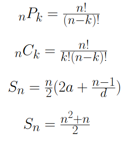

### Leetcode Solutions
This repository contains a list of solved leetoce problems.

## problems solved:

01 Matrix: https://leetcode.com/problems/01-matrix/

# Beginner Problem Set

 

## Complete

1. Two Sum: https://leetcode.com/problems/two-sum/solutions/3619262/3-method-s-c-java-python-beginner-friendly/
2. Roman to Integer: https://leetcode.com/problems/roman-to-integer/solutions/3651672/best-method-c-java-python-beginner-friendly/
3. Palindrome Number: https://leetcode.com/problems/palindrome-number/solutions/3651712/2-method-s-c-java-python-beginner-friendly/

## TODO

4. Maximum Subarray: https://leetcode.com/problems/maximum-subarray/solutions/3666304/beats-100-c-java-python-beginner-friendly/
5. Remove Element: https://leetcode.com/problems/remove-element/solutions/3670940/best-100-c-java-python-beginner-friendly/
6. Contains Duplicate: https://leetcode.com/problems/contains-duplicate/solutions/3672475/4-method-s-c-java-python-beginner-friendly/
7. Add Two Numbers: https://leetcode.com/problems/add-two-numbers/solutions/3675747/beats-100-c-java-python-beginner-friendly/
8. Majority Element: https://leetcode.com/problems/majority-element/solutions/3676530/3-methods-beats-100-c-java-python-beginner-friendly/
9. Remove Duplicates from Sorted Array: https://leetcode.com/problems/remove-duplicates-from-sorted-array/solutions/3676877/best-method-100-c-java-python-beginner-friendly/

# Other Notes

The following combinations equations simplify calculations of permuation number, combination number, and series summations. The first summations equation refers to the summation of any series from a to n with an interval of d and the second refers to summations of 1 to n with an interval of 1.

End of README.md file
